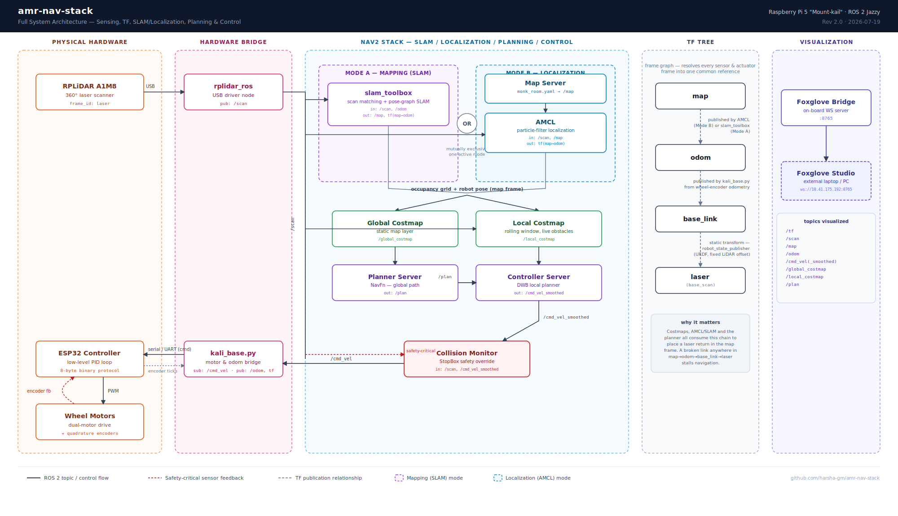

<div align="center">

# 🚀 Autonomous Mobile Robot (AMR) Navigation Stack
**State-of-the-Art ROS2 Navigation & Hardware Abstraction for Differential Drive AMRs**

[](https://docs.ros.org/en/humble/index.html)
[](https://www.python.org/)
[](#-hardware-architecture)
[](https://opensource.org/licenses/MIT)


*Core hardware interface, robust telemetry threads, and Nav2 configurations for an Autonomous Mobile Robot.*

</div>

---

## 📖 Table of Contents
- [Overview](#-overview)
- [System Architecture](#-system-architecture)
- [Core Components](#-core-components)
- [Communication Protocol](#-communication-protocol)
- [Challenges & Engineering Solutions](#-challenges--engineering-solutions)
- [Getting Started](#-getting-started)
- [Configuration Details](#-configuration-details)

---

## 🌟 Overview

This repository houses a production-grade ROS 2 hardware abstraction layer (HAL) and navigation stack configuration for a differential drive Autonomous Mobile Robot (AMR). The system bridges high-level AI/Path-Planning (Nav2) running on a Linux SBC with low-level real-time motor control executed by an ESP32 microcontroller. 

It handles everything from translating `cmd_vel` Twist messages into raw motor PWMs to processing high-frequency wheel encoder telemetry into accurate `/odom` topics and TF transforms—all while strictly validating serial data integrity.

---

## 🏗️ System Architecture

<div align="center">

<br><br>
<em>Full system architecture — from physical sensors to Nav2 planning to visualization.<br>
Click the image to view full resolution.</em>
</div>

<br>

The diagram above illustrates the end-to-end data flow across **five architectural zones**:

### 🔩 Physical Hardware
| Component | Role |
|---|---|
| **RPLiDAR A1M8** | 360° laser scanner providing `/scan` data in the `laser` frame |
| **ESP32 Controller** | Real-time PID motor control via FreeRTOS, 8-byte binary protocol over UART |
| **Wheel Motors** | Dual-motor differential drive with quadrature encoders (400 ticks/rev) |

### 🔌 Hardware Bridge
| Node | Function |
|---|---|
| **`rplidar_ros`** | USB driver node — publishes `/scan` topic |
| **`kali_base.py`** | Motor & odometry bridge — subscribes to `/cmd_vel`, publishes `/odom` and TF (`odom → base_footprint`) |

### 🧭 Nav2 Stack — SLAM / Localization / Planning / Control
The Nav2 stack operates in one of two **mutually exclusive modes**:

| Mode | Node | Purpose |
|---|---|---|
| **Mode A — Mapping** | `slam_toolbox` | Scan-matching + pose-graph SLAM → publishes `/map` and `tf(map→odom)` |
| **Mode B — Localization** | `Map Server` + `AMCL` | Loads pre-built map, particle-filter localization → publishes `tf(map→odom)` |

Both modes feed into the **costmap → planner → controller** pipeline:

- **Global Costmap** — Static map layer for long-range planning
- **Local Costmap** — Rolling window with live obstacle detection
- **Planner Server** — NavFn global path planner → outputs `/plan`
- **Controller Server** — DWB local planner → outputs `/cmd_vel_smoothed`
- **Collision Monitor** — Safety-critical StopBox override using `/scan` + `/cmd_vel_smoothed` → outputs final `/cmd_vel`

### 🌳 TF Tree
The transform chain `map → odom → base_link → laser` resolves every sensor and actuator into one common reference frame. A broken link anywhere in this chain stalls navigation entirely.

| Transform | Publisher |
|---|---|
| `map → odom` | AMCL (Mode B) or slam_toolbox (Mode A) |
| `odom → base_link` | `kali_base.py` (wheel-encoder odometry) |
| `base_link → laser` | `robot_state_publisher` (static, from URDF) |

### 📊 Visualization
**Foxglove Bridge** runs an on-board WebSocket server (`:8765`) streaming all topics to **Foxglove Studio** on an external laptop for real-time monitoring of `/tf`, `/scan`, `/map`, `/odom`, `/cmd_vel`, costmaps, and `/plan`.

### ⚙️ Robot Kinematics
| Parameter | Value |
|---|---|
| Drive type | Differential |
| Track width (Wheel Base) | `0.116 m` |
| Wheel Radius | `0.0335 m` |
| Encoder Resolution | `400 ticks/rev` |
| Max Speed | `0.21 m/s` |

---

## ✨ Core Components

### ROS 2 Interface
- **`kali_base.py` / `kali_base_node.py`**: The heart of the stack. These nodes translate incoming `/cmd_vel` geometry messages into left/right wheel velocities. They also maintain a dedicated background daemon thread to continuously read incoming serial telemetry, calculate Euler-based odometry integration at 20Hz, and broadcast `/odom` and `odom -> base_footprint` TF frames.

### Embedded Firmware
- **`esp32_firmware.ino`**: Multi-threaded FreeRTOS C++ firmware running on the ESP32. It utilizes ESP32's dedicated PCNT (Pulse Counter) hardware for zero-overhead encoder tracking. A strict 50Hz control loop runs continuously on Core 1 to compute PID outputs, while UART parsing and Watchdog timers ensure the robot stops safely if connection to the ROS 2 host is lost.

### Navigation & Mapping
- **`nav2_params.yaml`**: Highly-tuned Nav2 parameters tailored for this specific AMR. Features DWB Local Planner configuration, AMCL particle filter settings (500-2000 particles), dual costmaps (Global & Local) with inflation layers (0.22m radius), and a strict Collision Monitor with a virtual "StopBox" polygon.
- **`monk_room_map.yaml`**: Pre-generated SLAM map configuration files for immediate deployment.

### Diagnostics & Tooling
- **`robot_bridge.py`**: A standalone, zero-dependency Python script to directly test the ESP32 serial protocol without needing the ROS 2 daemon. Essential for hardware debugging.
- **`test_lider.py`**: A lightweight diagnostic tool leveraging the `rplidar` library to verify LiDAR health and scan frequency before launching the heavy ROS 2 stack.
- **`start_monk.sh` & `get-docker.sh`**: Helper scripts for launching the controller and provisioning containerized robotic environments seamlessly.

---

## 🔌 Communication Protocol

To ensure 100% reliable data transmission between the Linux SBC and the ESP32, a custom XOR-checksummed binary packet protocol over UART (115200 baud) was designed:

**Tx (Command) Packet (6 Bytes):**
`[ 0x02 (Start) | Left PWM | Right PWM | Unused (0x00) | Checksum | 0x03 (End) ]`

**Rx (Telemetry) Packet (8 Bytes):**
`[ 0x02 (Start) | L_Ticks_Low | L_Ticks_High | R_Ticks_Low | R_Ticks_High | Unused | Checksum | 0x03 (End) ]`

*Checksum logic: `(Byte 1 ^ Byte 2)` ensuring corrupted data packets are dropped instantly without causing jerky robot motions.*

---

## 🛠️ Challenges & Engineering Solutions

1. **Blocking Serial Reads in ROS 2:**
   - *Issue*: Standard serial reads inside a ROS timer callback would block the ROS 2 event loop, leading to dropped `cmd_vel` messages and terrible latency.
   - *Fix*: Implemented Python `threading.Thread(target=self.receive_telemetry, daemon=True)`. This isolates the high-speed UART parsing into a separate thread, safely sharing the parsed tick data with the 20Hz ROS 2 odometry publisher loop.

2. **UART Data Corruption & Odometry Jumps:**
   - *Issue*: EMI from the motors occasionally flipped bits on the USB serial line, causing massive sudden spikes in encoder tick readings which destroyed the robot's localization.
   - *Fix*: Designed the lightweight XOR binary checksum protocol. The Python bridge silently discards any packet where `calc_checksum != checksum`, completely eliminating odometry jumps.

3. **Documentation Rendering Issues (GitHub):**
   - *Issue*: The `demo.gif` showcase was 7.5MB, causing GitHub's Camo proxy to frequently timeout and display a broken image link for visitors.
   - *Fix*: Wrote a custom compression script to halve the framerate and reduce the color palette to 64 colors, shrinking the GIF by 85% to 1.0MB and adding explicit `width="700"` tags for robust rendering.

4. **Real-time Motor Control on ESP32:**
   - *Issue*: Handling high-frequency encoder interrupts on the microcontroller while parsing incoming serial commands and computing PID loops often leads to missed pulses or jittery movement.
   - *Fix*: Built the ESP32 firmware using a FreeRTOS multi-threaded architecture. Offloaded encoder counting entirely to the ESP32's hardware PCNT peripheral (zero CPU usage). Pinned a strict 50Hz PID control loop to Core 1, and protected shared command variables with FreeRTOS Mutexes (`xSemaphoreTake`), resulting in silky smooth motor operation and rock-solid reliability.

---

## 🚀 Getting Started

### Prerequisites
- ROS 2 (Humble/Jazzy) installed on Ubuntu 22.04/24.04.
- Python 3.8+ with `pyserial` and `rplidar-robotic`.
```bash
pip3 install pyserial rplidar-robotic
```

### Hardware Setup
1. Mount the ESP32 and connect via USB. Ensure it appears at `/dev/ttyUSB1` (or update `SERIAL_PORT` in `kali_base.py`).
2. Give your user serial permissions: `sudo usermod -aG dialout $USER`.
3. Connect the RPLiDAR to `/dev/ttyUSB0`.

### Running the Stack

**1. Hardware Diagnostics (Optional)**
Verify serial and LiDAR before starting ROS:
```bash
python3 robot_bridge.py
python3 test_lider.py
```

**2. Start the ROS 2 Base Controller**
```bash
./start_monk.sh
# OR manually:
python3 kali_base_node.py
```

---

<div align="center">
<i>Built with ❤️ for robust, autonomous robotic exploration.</i>
</div>
