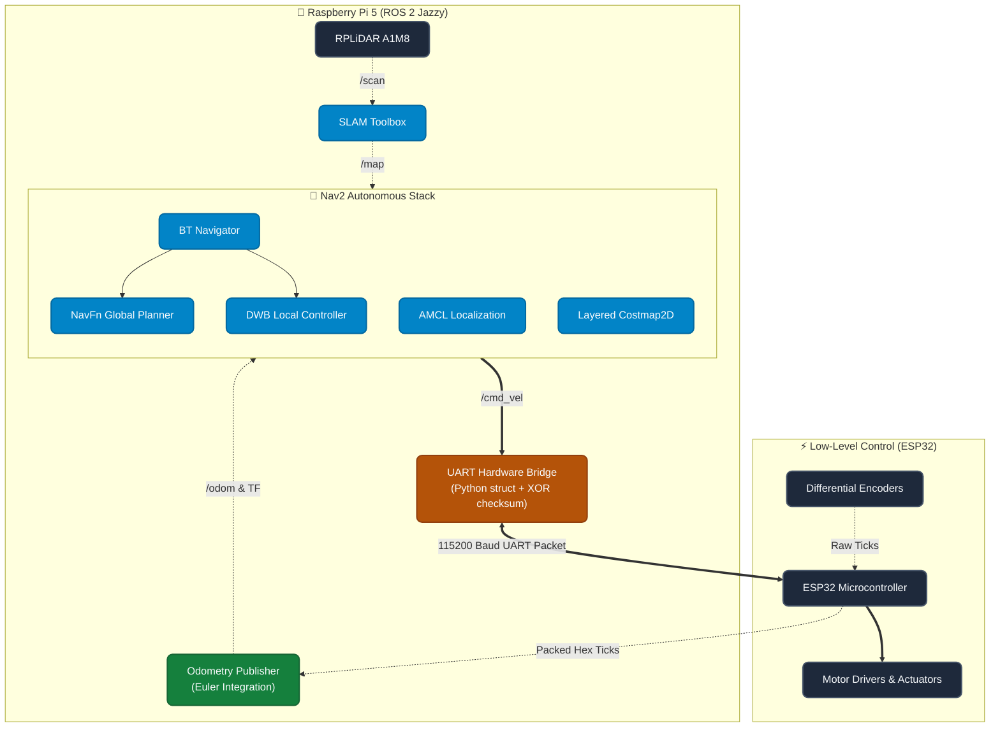

# 🤖 AMR Navigation Stack — ROS2 + Raspberry Pi 5 + ESP32

> Full autonomous navigation stack for a differential-drive mobile robot. SLAM mapping, Nav2 path planning, and custom embedded control — running on real hardware.

[](https://docs.ros.org/en/jazzy/)
[](https://www.raspberrypi.com/)
[](https://www.docker.com/)
[]()

---

## 📋 Overview

This project implements a **production-grade autonomous navigation pipeline** on a differential-drive mobile robot built with a Raspberry Pi 5 and ESP32 microcontroller. The system covers the complete autonomy stack:

```
RPLiDAR A1M8 → SLAM Mapping → Nav2 Planning → Motor Control → ESP32 Actuators
```

### Key Features
- 🗺️ **Real-time SLAM** mapping with `slam_toolbox`
- 🧭 **Full Nav2 stack**: AMCL localization → NavFn global planner → DWB local planner
- ⚡ **Custom hardware interface**: Multi-threaded ROS2 node translating `/cmd_vel` into ESP32 motor commands via binary UART protocol with XOR checksum validation
- 📐 **Differential-drive odometry**: Encoder-based dead reckoning publishing `/odom` and TF transforms
- 🛡️ **Collision monitoring**: Layered costmaps (static + inflation + obstacle layers)
- 🐳 **Docker containerized** for reproducible deployment

---

## 🏗️ System Architecture


```mermaid
flowchart TD
    %% Custom Styles for a Professional Aesthetic
    classDef hardware fill:#1e293b,stroke:#475569,stroke-width:2px,color:#f8fafc,rx:8px,ry:8px;
    classDef software fill:#0284c7,stroke:#0369a1,stroke-width:2px,color:#f8fafc,rx:8px,ry:8px;
    classDef rosnode fill:#15803d,stroke:#166534,stroke-width:2px,color:#f8fafc,rx:8px,ry:8px;
    classDef comms fill:#b45309,stroke:#92400e,stroke-width:2px,color:#f8fafc,rx:8px,ry:8px;
    
    %% Core System Graph
    subgraph RPi ["🚀 Raspberry Pi 5 (ROS 2 Jazzy)"]
        direction TB
        
        LIDAR["RPLiDAR A1M8"]:::hardware -.->|/scan| SLAM["SLAM Toolbox"]:::software
        
        subgraph Nav2 ["🧭 Nav2 Autonomous Stack"]
            direction TB
            BT["BT Navigator"]:::software --> NavFn["NavFn Global Planner"]:::software
            BT --> DWB["DWB Local Controller"]:::software
            AMCL["AMCL Localization"]:::software
            Costmap["Layered Costmap2D"]:::software
        end
        
        SLAM -.->|/map| Nav2
        ODOM["Odometry Publisher<br/>(Euler Integration)"]:::rosnode -.->|/odom & TF| Nav2
        
        Nav2 == /cmd_vel ===> HW["UART Hardware Bridge<br/>(Python struct + XOR checksum)"]:::comms
    end

    subgraph ESP ["⚡ Low-Level Control (ESP32)"]
        direction TB
        MCU["ESP32 Microcontroller"]:::hardware
        Motors["Motor Drivers & Actuators"]:::hardware
        Encoders["Differential Encoders"]:::hardware
    end

    HW <=="115200 Baud UART Packet"==> MCU
    MCU ==> Motors
    Encoders -.->|Raw Ticks| MCU
    MCU -.->|Packed Hex Ticks| ODOM
```

### TF Transform Tree
```
map → odom → base_footprint → base_link → [laser_frame, left_wheel, right_wheel]
```

---

## 🔧 Hardware Specifications

| Component | Specification |
|:----------|:-------------|
| **Compute** | Raspberry Pi 5 (16GB RAM) |
| **Microcontroller** | ESP32 (motor control + encoder reading) |
| **LiDAR** | RPLiDAR A1M8 (360° scan, 12m range) |
| **Drive** | Differential-drive (track width: 0.116m, wheel radius: 0.0335m) |
| **Communication** | Custom binary UART protocol with XOR checksum validation |

---

## 🚀 Quick Start

### Prerequisites
- Ubuntu 22.04 (ARM64 for RPi5)
- ROS2 Jazzy
- Docker (optional)

### Launch with Docker
```bash
docker compose up
```

### Launch manually
```bash
# Terminal 1: Hardware interface + sensors
ros2 launch amr_bringup hardware.launch.py

# Terminal 2: SLAM mapping (first run)
ros2 launch amr_bringup slam.launch.py

# Terminal 3: Navigation (after map is saved)
ros2 launch amr_bringup navigation.launch.py map:=./maps/my_map.yaml
```

---

## 🐛 Notable Debugging Win

Diagnosed and resolved a **cascading Nav2 lifecycle bringup failure** affecting all 9 managed nodes. Root cause chain:
1. Misconfigured docking server parameters
2. Missing AMCL initial pose publication
3. Incorrect `base_frame` in behavior-server config
4. Busy-wait loop starving the controller server's executor

Resolution required deep understanding of ROS2 lifecycle node management and the Nav2 managed node activation sequence. Documented the full debugging process in the [wiki](../../wiki).

---

## 📊 Results

- ✅ Successful real-time SLAM mapping of indoor environment
- ✅ Autonomous point-to-point navigation with obstacle avoidance
- ✅ Validated on physical hardware using Foxglove Studio
- ✅ Clean lifecycle activation across all 9 Nav2 managed nodes

---

## 📁 Repository Structure

```
amr-nav-stack/
├── amr_bringup/          # Launch files and configs
│   ├── launch/
│   ├── config/           # Nav2, AMCL, SLAM parameters
│   └── maps/             # Saved occupancy grid maps
├── amr_hardware/         # Custom hardware interface
│   ├── uart_bridge.py    # UART protocol with XOR checksum
│   └── diff_drive.py     # Odometry computation
├── amr_description/      # URDF/Xacro robot model
├── docker/               # Dockerfiles and compose
└── docs/                 # Architecture diagrams
```

---

## 🛣️ Roadmap

- [ ] Add IMU fusion via `robot_localization` EKF
- [ ] Implement multi-waypoint navigation
- [ ] Add simulated Gazebo environment for testing
- [ ] CI/CD with GitHub Actions

---

## 📜 License

MIT License — see [LICENSE](LICENSE) for details.
