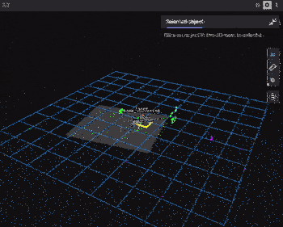
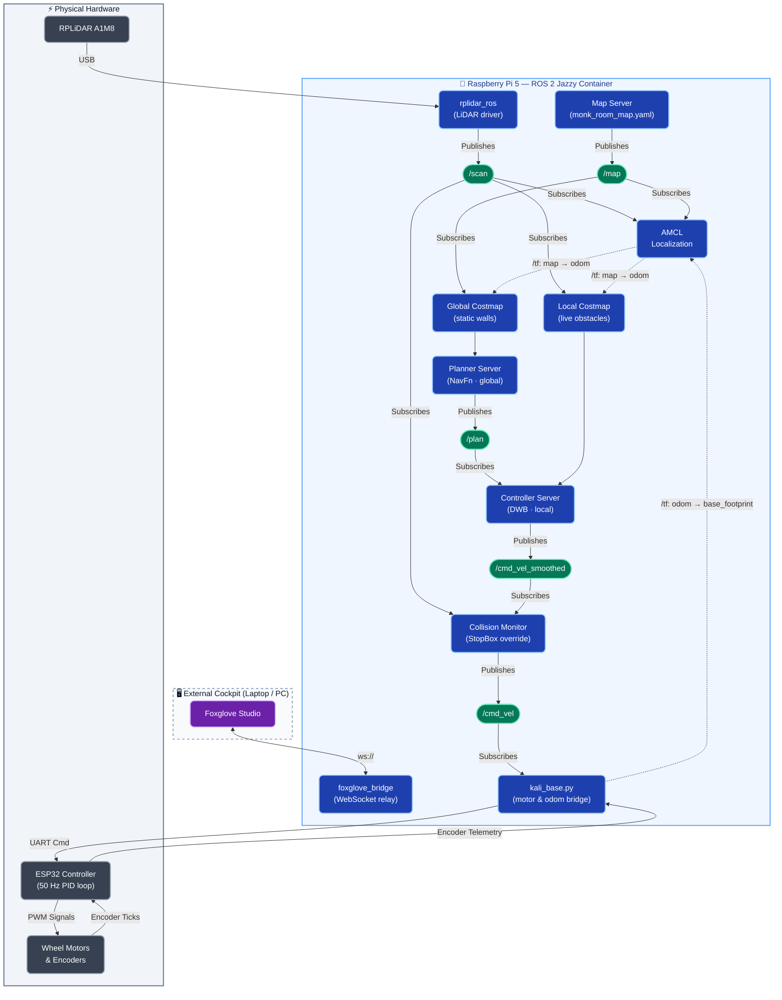

# 🤖 AMR Navigation Stack — ROS2 + Raspberry Pi 5 + ESP32

> Full autonomous navigation stack for a differential-drive mobile robot. SLAM mapping, Nav2 path planning, and custom embedded control — running on real hardware.



[](https://docs.ros.org/en/jazzy/)
[](https://www.raspberrypi.com/)
[](https://www.docker.com/)
[]()

---

## 📋 Overview

This project implements a **production-grade autonomous navigation pipeline** on a differential-drive mobile robot built with a Raspberry Pi 5 and ESP32 microcontroller. The system covers the complete autonomy stack:

```
RPLiDAR A1M8 → SLAM Mapping → Nav2 Planning → Motor Control → ESP32 Actuators
```

### Key Features
- 🗺️ **Real-time SLAM** mapping with `slam_toolbox`
- 🧭 **Full Nav2 stack**: AMCL localization → NavFn global planner → DWB local planner
- ⚡ **Custom hardware interface**: Multi-threaded ROS2 node translating `/cmd_vel` into ESP32 motor commands via binary UART protocol with XOR checksum validation
- 📐 **Differential-drive odometry**: Encoder-based dead reckoning publishing `/odom` and TF transforms
- 🛡️ **Collision monitoring**: Layered costmaps (static + inflation + obstacle layers)
- 🐳 **Docker containerized** for reproducible deployment

---

## 🏗️ System Architecture


```mermaid
flowchart TB
    %% Styling Definitions
    classDef cockpit  fill:#6B21A8,stroke:#D8B4FE,stroke-width:2px,color:#FFFFFF,rx:8,ry:8
    classDef rosnode  fill:#1E40AF,stroke:#93C5FD,stroke-width:2px,color:#FFFFFF,rx:8,ry:8
    classDef topic    fill:#047857,stroke:#6EE7B7,stroke-width:2px,color:#FFFFFF,rx:15,ry:15
    classDef hardware fill:#374151,stroke:#9CA3AF,stroke-width:2px,color:#FFFFFF,rx:8,ry:8

    %% Cockpit Environment
    subgraph Cockpit ["🖥️ External Cockpit (Laptop / PC)"]
        Studio["Foxglove Studio"]:::cockpit
    end

    %% Raspberry Pi Environment
    subgraph Pi ["🚀 Raspberry Pi 5 — ROS 2 Jazzy Container"]
        Bridge["foxglove_bridge<br/>(WebSocket relay)"]:::rosnode
        
        MapSrv["Map Server<br/>(monk_room_map.yaml)"]:::rosnode
        AMCL["AMCL<br/>Localization"]:::rosnode
        
        GCost["Global Costmap<br/>(static walls)"]:::rosnode
        LCost["Local Costmap<br/>(live obstacles)"]:::rosnode
        
        Planner["Planner Server<br/>(NavFn · global)"]:::rosnode
        Ctrl["Controller Server<br/>(DWB · local)"]:::rosnode
        CollMon["Collision Monitor<br/>(StopBox override)"]:::rosnode
        
        Base["kali_base.py<br/>(motor & odom bridge)"]:::rosnode
        LidarDrv["rplidar_ros<br/>(LiDAR driver)"]:::rosnode
        
        %% Topics as Hubs
        T_Map(["/map"]):::topic
        T_Scan(["/scan"]):::topic
        T_Plan(["/plan"]):::topic
        T_Smooth(["/cmd_vel_smoothed"]):::topic
        T_Cmd(["/cmd_vel"]):::topic
    end

    %% Hardware Environment
    subgraph HW ["⚡ Physical Hardware"]
        RPLIDAR["RPLiDAR A1M8"]:::hardware
        ESP32["ESP32 Controller<br/>(50 Hz PID loop)"]:::hardware
        Motors["Wheel Motors<br/>& Encoders"]:::hardware
    end

    %% ==========================================
    %% Edge Connections & Pipelines
    %% ==========================================

    %% Cockpit ↔ Bridge
    Studio <-->|"ws://"| Bridge

    %% Sensor Data Flow
    RPLIDAR -->|"USB"| LidarDrv
    LidarDrv -->|"Publishes"| T_Scan
    T_Scan -->|"Subscribes"| AMCL
    T_Scan -->|"Subscribes"| LCost
    T_Scan -->|"Subscribes"| CollMon

    %% Map Pipeline
    MapSrv -->|"Publishes"| T_Map
    T_Map -->|"Subscribes"| AMCL
    T_Map -->|"Subscribes"| GCost

    %% TF / Odom (Coordinate Transforms)
    Base -.->|"/tf: odom → base_footprint"| AMCL
    AMCL -.->|"/tf: map → odom"| GCost
    AMCL -.->|"/tf: map → odom"| LCost

    %% Planning Pipeline
    GCost --> Planner
    Planner -->|"Publishes"| T_Plan
    T_Plan -->|"Subscribes"| Ctrl

    %% Control Pipeline
    LCost --> Ctrl
    Ctrl -->|"Publishes"| T_Smooth
    T_Smooth -->|"Subscribes"| CollMon
    CollMon -->|"Publishes"| T_Cmd
    T_Cmd -->|"Subscribes"| Base

    %% Motor Control Loop
    Base -->|"UART Cmd"| ESP32
    ESP32 -->|"Encoder Telemetry"| Base
    ESP32 -->|"PWM Signals"| Motors
    Motors -->|"Encoder Ticks"| ESP32

    %% ==========================================
    %% Subgraph Styling
    %% ==========================================
    style Cockpit fill:#F8FAFC,stroke:#94A3B8,stroke-width:2px,stroke-dasharray: 5 5,color:#0F172A
    style Pi fill:#EFF6FF,stroke:#60A5FA,stroke-width:2px,color:#1E3A8A
    style HW fill:#F1F5F9,stroke:#64748B,stroke-width:2px,color:#0F172A
```

### TF Transform Tree
```
map → odom → base_footprint → base_link → laser_frame
```

- `map → odom` — published by **AMCL** (localization corrects drift).
- `odom → base_footprint` — published by **kali_base.py** from encoder ticks.
- `base_footprint → base_link` — static (robot body / URDF).
- `base_link → laser_frame` — static (LiDAR mounting).

> 🎨 Prefer an interactive view? Open the [architecture diagram](docs/architecture.html) — zoom, pan, and download the SVG. There's also a [static SVG](docs/architecture.svg).

---

## 🔧 Hardware Specifications

| Component | Specification |
|:----------|:-------------|
| **Compute** | Raspberry Pi 5 (16GB RAM) |
| **Microcontroller** | ESP32 (motor control + encoder reading) |
| **LiDAR** | RPLiDAR A1M8 (360° scan, 12m range) |
| **Drive** | Differential-drive (track width: 0.116m, wheel radius: 0.0335m) |
| **Communication** | Custom binary UART protocol with XOR checksum validation |

---

## 🚀 Quick Start

### Prerequisites
- Ubuntu 22.04 (ARM64 for RPi5)
- ROS2 Jazzy
- Docker (optional)

### Launch with Docker
```bash
docker compose up
```

### Launch manually
```bash
# One-command bring-up (hardware bridge + Nav2)
./start_monk.sh path/to/map.yaml

# Or run the pieces separately:
# Terminal 1: hardware bridge + wheel odometry
python3 kali_base.py

# Terminal 2: Nav2 (AMCL + navigation) with saved map
ros2 launch nav2_bringup bringup_launch.py map:=./monk_room_map.yaml params_file:=./nav2_params.yaml
```
> **Note:** the saved map (`monk_room_map.yaml`) is generated on the robot via `slam_toolbox` and is not committed to this repo — re-run SLAM mapping to produce it before navigation.

---

## 🐛 Notable Debugging Win

Diagnosed and resolved a **cascading Nav2 lifecycle bringup failure** affecting all 9 managed nodes. Root cause chain:
1. Misconfigured docking server parameters
2. Missing AMCL initial pose publication
3. Incorrect `base_frame` in behavior-server config
4. Busy-wait loop starving the controller server's executor

Resolution required deep understanding of ROS2 lifecycle node management and the Nav2 managed node activation sequence.

---

## 📊 Results

- ✅ Successful real-time SLAM mapping of indoor environment
- ✅ Autonomous point-to-point navigation with obstacle avoidance
- ✅ Validated on physical hardware using Foxglove Studio
- ✅ Clean lifecycle activation across all 9 Nav2 managed nodes

---

## 📁 Repository Structure

```
amr-nav-stack/
├── kali_base.py          # Custom ROS 2 node: /cmd_vel → UART (inverse kinematics),
│                         #   encoder ticks → /odom + TF (20 Hz odometry)
├── robot_bridge.py       # Pre-ROS UART test harness (protocol validation)
├── test_lider.py         # RPLiDAR A1M8 smoke test
├── nav2_params.yaml      # Full Nav2 config: AMCL, BT navigator, DWB, costmaps,
│                         #   velocity smoother, collision monitor
├── start_monk.sh         # One-command bring-up (hardware bridge + Nav2)
├── firmware/
│   └── esp32_firmware/   # ESP32 FreeRTOS firmware: 50 Hz PI control + 150 ms watchdog
├── docs/                 # Architecture diagrams (SVG)
└── demo_v2.gif           # Demo recording
```

---

## 🛣️ Roadmap

- [ ] Add IMU fusion via `robot_localization` EKF
- [ ] Implement multi-waypoint navigation
- [ ] Add simulated Gazebo environment for testing
- [ ] CI/CD with GitHub Actions

---

## 📜 License

MIT License — see [LICENSE](LICENSE) for details.
